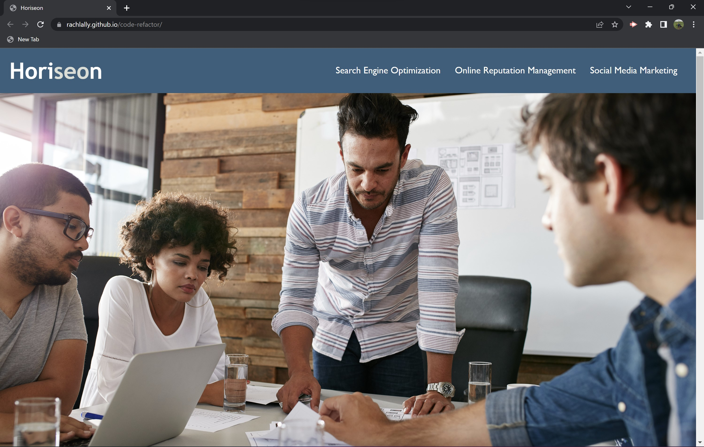
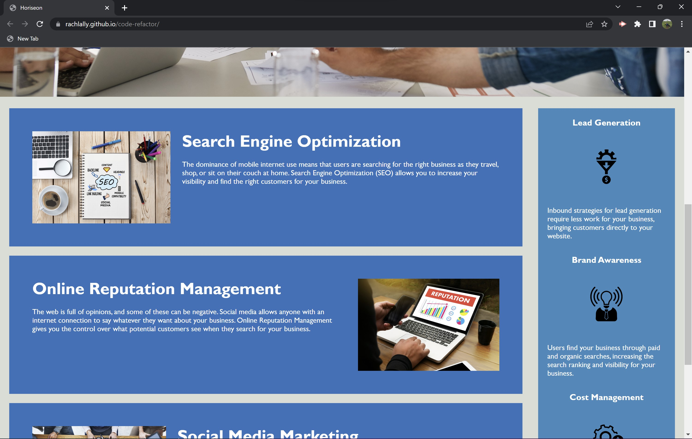
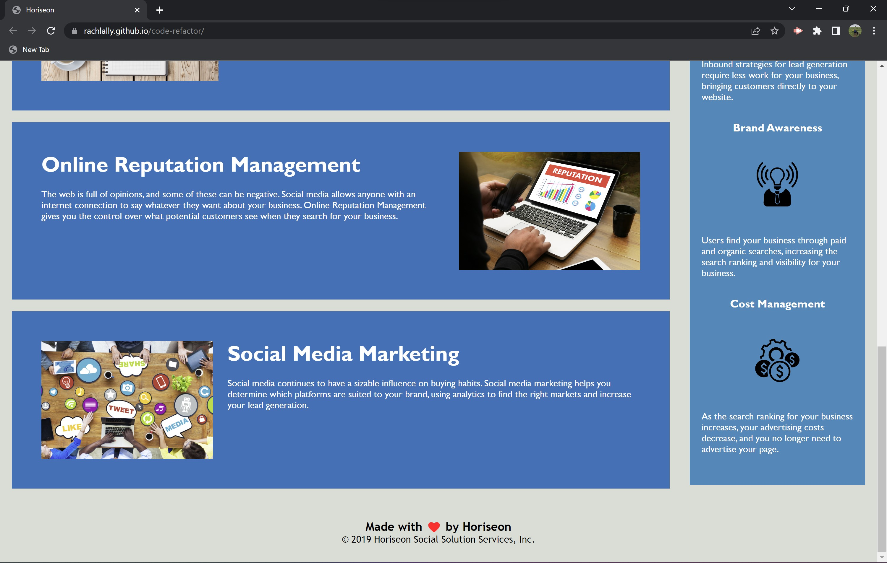

# Unit 1 Code Refactor

## Description

The purpose of the code refactor challenge was to explore and ensure that the Horiseon website's codebase met all accessibility standards.  By doing this, the website will be optimized for search engines.    

There were several elements missing including alt attributes and semantic HTML.  There were also styling and ordering issues to address.  The site was missing a title and links for better navigation through the page.  

By examining the codebase, reading articles on accessibility standards, and implementing new code I was able to ensure that Horiseon's site follows current accessbility standards to ensure search engine optizamtion.  Additionally, the links in the page are working and CSS is organized and condensed. In practicing the Scout's Rule, the website, HTML, and CSS was left in a better condition for future developers. 

I learned what accessbility standards are and how to write the code for those.  I learned how to identify and label semantic HTML.  I learned the importance of regularly committing my work through git work flow.  

## Installation

N/A

## Usage

Below are screenshots of the deployed website:

Navigation of this site is user friendly.  On the landing page, the user is met with a header which includes a navigation bar.  The navigation bar includes three locations within the page: Search Engine Optimization, Online Reputation Management, and Social Media Marketing.  Clicking on any of these links will take the user to that particular section of the main content.

The deployed site is available at https://rachlally.github.io/code-refactor/

## Credits

Ultimate Guide to Alt Attribute (or Alt Text).  Kang, Jay. 2022. https://www.seoptimer.com/blog/alt-attribute/

## License

N/A